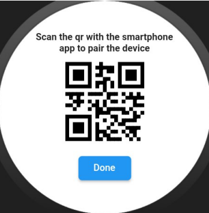
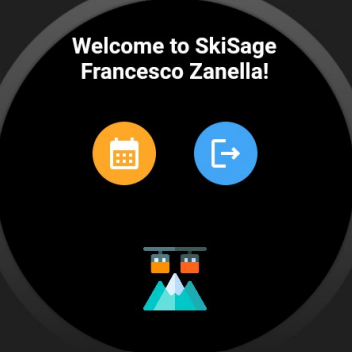
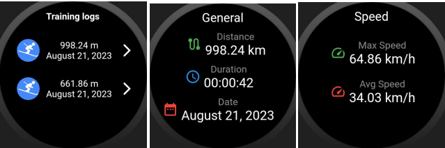

# SkiResort - README
SkiResort is a crossplatform (IOS and Android) + smartwatch (Wear OS) integration developed in Flutter.
## Table of Contents

- [1. SkiResort goal](#1.)
- [2. Prerequisites](#2.rerequisites)
- [3. Installation](#3.-Installation)
- [4. Features implemented](#4.-How-to-Play)
  - [4.1 Login and registration](#4.1-Teams)
  - [4.2 Map of Resorts](#4.2-budget)
  - [4.3 User-Ranked Best Resorts](#4.3-subs-bank)
  - [4.4 Save and Share Resorts](#4.4-leagues)
  - [4.5 Training Session Recording](#4.5-points-scoring)
  - [4.6 Comprehensive Training Statistics](#4.6-results)
- [5. External Services](#5.-external)
- [6. How it works? DEMO](#6.)
- [7. Report](#7.)
- [8. Contributors](#6.-contributors)


## SkiResort goal

SkiResort is an app that lets you train and discover Italy's skiing resorts. Select and review top
resorts, gain insights from fellow skiers' rankings, and save your favorite spots to share
across platforms.
Enhance your skiing experience by initiating real-time training sessions to record your
performance, delve deep into post-session statistics, and track your progress over time with
a complete training history.

## 2. Prerequisites

Before you begin with the installation, make sure you have the following prerequisites in place:

- **Flutter and Dart SDK**
  - You'll need to have Flutter JDK installed on your system. If you don't have it installed, you can download and install it from [Flutter SDK](https://docs.flutter.dev/get-started/install).

- **Git**
  - Git is required to clone the repository and manage the source code. If you don't have Git installed, you can download it from [Git Downloads](https://git-scm.com/downloads).

- **Android Studio**
  - Android studio is needed to run the emulator.

Make sure these prerequisites are properly installed and configured on your system before proceeding with the installation.

## 3. Installation
To get started, follow these simple steps:

1. **Clone the Repository**
  - Begin by cloning the project's repository to your local machine. You can do this by running the following command in your terminal:

    ```
    git clone https://github.com/FrancescoZanella/DimaProject.git
    ```

2. **Run the Application**
  - After having cloned the application, you can run it using the following command from the repository folder:

    ```
    flutter run
    ```

## 4. Features implemented

### 4.1 Login and Registration

We have developed a custom classic sign in/sign up through email address and we have
added also the possibility to sign in/sign up using the Single-Sign-On (SSO) functionality with
Google identity providers

### 4.2 Map of Resorts

Users can see all the Italian resorts on the map; each resort is indicated on the map with a
specific icon and the size of the icon is directly proportional to the average of the reviews of
that resort. The user can either review each resort or save it as a favorite. So if the reviews
5
average changes a lot this can influence a lot the visibility of a resort on the map; indeed the
resort icon will be bigger or smaller.


### 4.3 User-Ranked Best Resorts

The app offers insights into the most highly-rated resorts based on feedback from other
users, giving a crowd-sourced ranking. In particular in the “most popular resort screen” the
10 Italian resorts with the best reviews are shown. Obviously this is a dynamic ranking and
based on the reviews of other users the resorts will change.


### 4.4 Save and Share Resorts

Users can save their favorite resorts and effortlessly share them across multiple platforms,
enhancing the social experience of the app. The container that contains every information
about a resort is transformed into a picture and that picture is shareable everywhere:
telegram, whatsapp, instagram, email, bluetooth ecc. In this way you can tell your friends
where you are or where you want to go to ski.

### 4.5 Training Session Recording
While skiing, users can initiate a training session within the app to track and record their
skiing performance in real-time. A variety of data is measured including user location,
average speed, max speed, training time, distance travelled etc.

### 4.6 Comprehensive Training Statistics and training overview
Post-training, users can access detailed statistics from their session, providing insights into
their performance and areas of improvement. For example, a graph is shown that clearly
represents the speed trend over time. Users can view their entire training history, allowing them to track progress over time; each workout is saved by recording the date, time and location; the list of all workouts is visible on
a dedicated screen. The app also highlights the best performance of a user, indeed, the best
performance is highlighted in the home page.

## 5. External Services
  - **Firebase Authentication + Google Sign-In**
  - **OpenStreetMaps API**

## 6. How it works[DEMO and screenshots]
### Smartphone DEMO
Here are a demo of the SkiResort application to give you a glimpse of its user interface and features of the smartphone:


https://github.com/FrancescoZanella/DimaProject/assets/64276252/a7397f61-19ff-4918-9984-cb5d7afbb13a


### Smartwatch UI
We decided to add smartwatch layout support because in our opinion this provides a more
immersive user experience during training sessions, ensuring that users have instant access
to their data without the need to constantly check their phones.
The whole process of connection and data exchange is managed through firebase.
#### Connection Page



The Connection Page displays a QR code for users to scan. Once scanned using a phone, it
establishes a pairing with that device. This connection is maintained until the user voluntarily
disconnects, either from the phone or the watch itself.

#### HomePage



The Home Page offers a straightforward menu, showcasing the name and icon of the app. It
features two buttons - one for disconnecting the paired device and another that navigates to
the Training Page
#### Training Page



On the Training Page, users can view all their training sessions. A list presents these
sessions, and for each training entry, users can access statistics such as speed, date, and
duration of the training, among others.

## 7. Report[Design Document]
For all the details about the model you can read the [report](https://github.com/FrancescoZanella/DimaProject/blob/master/SkiSageDD.pdf), where everyting is explained in detail.
## 8. Contributors

This is a side project made for University Course of Design and Implementation of Mobile Application at Polimi. 

- [Francesco Zanella](https://github.com/FrancescoZanella)
- [Stefano Chiodini](https://github.com/Iacopo99)


    


